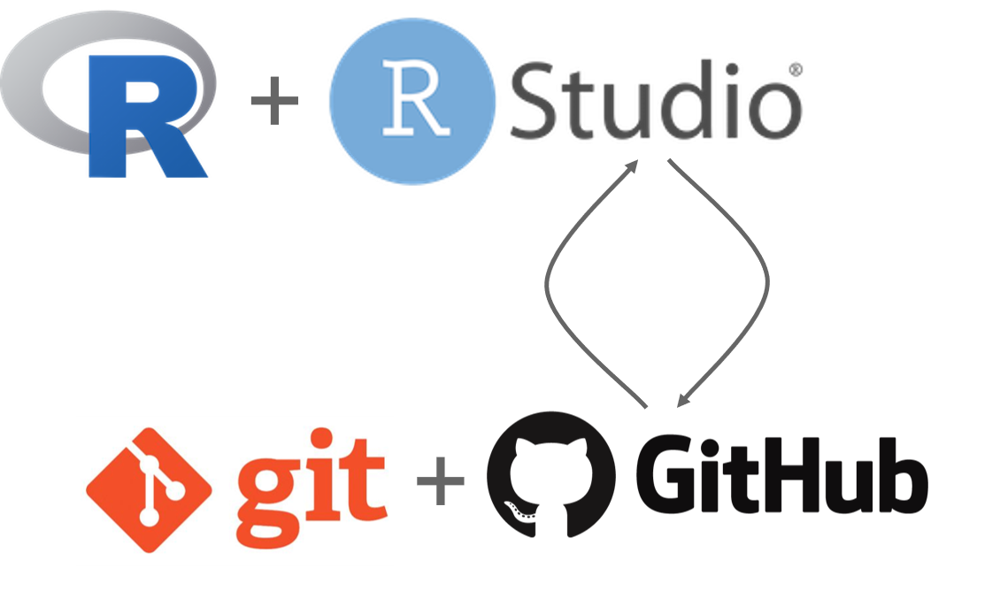

```{r setup, include=FALSE}
options(htmltools.dir.version = FALSE)
```

---
# Outline of class

1. What is reproducible science? 

1. Open science: Should data and protocols be public?

1. Tools for reproducible science:
  - Rstudio
  - Github


---

# Reproducibility - what is it?

--
 
### “U.S. National Science Foundation (NSF) subcommittee on replicability in science: ‘reproducibility refers to the **ability of a researcher to duplicate the results of a prior study using the same materials as were used by the original investigator.'**”

.center[
 
]
.foot.note[Goodman et al., Science Translational Medicine  01 Jun 2016:
Vol. 8, Issue 341, pp. 341ps12
DOI: 10.1126/scitranslmed.aaf5027 
]

---
# We are in a reproducibility crisis in science
.center[

]
.foot-note[Monya Baker (2016). 1500 scientists lift the lid on reproducibility. Nature 533 (7604).
]

---

# Types of reproducibility

.foot-note[From Victoria Stodden (as summarized in the ROpenSci Reproducibility Guide)] 

“**Computational reproducibility**: when detailed information is provided about code, software, hardware and implementation details.”

--

“**Empirical reproducibility**: when detailed information is provided about non-computational empirical scientific experiments and observations. In practise this is enabled by making data freely available, as well as details of how the data was collected.”

--

“**Statistical reproducibility**: when detailed information is provided about the choice of statistical tests, model parameters, threshold values, etc. This mostly relates to pre-registration of study design to prevent p-value hacking and other manipulations.”

---
# Is this how you have been working?

 ### If so, that's ok! Let's learn together.
 
 
 

---
# What about this workflow makes it hard to reproduce?

 
 
 
---
# A few areas for improvement

--

- No clear or organized history of what’s been done to the data from raw data through final figures/results  

--

- Lack of comments/annotation describing the steps  

--

- Tedious & time consuming for a collaborator to recreate the analyses 

--

- Backed up w/version control? Probably not…  

--

- How do we transfer this into a final report or presentation? Is that reproducible?  

--

- Note all the slides I make for this class are.... in R!

---
# Why does this matter?

Say I’ve been **arrested for a murder** that was committed 6 months ago. My attorney says it’s very important to remember exactly what I did on the day of the murder to establish an alibi. I try my best to remember, and come up with this diagram describing my day: 

.center[

]

---

## My attorney is like “bummer...” 

.center[

]  


---

## I wrack my brain and come up with this order of things:

.center[
{width=30%}
]

.foot-note[Still not great...]


---


## But then! I remember I had a datebook with all this information...


 .center[]


---
# Do your **Data Sci** like it is going to need an **alibi**.


---
# With data that looks something like...

 

---

# The workflow we will grow in this class...

*We will do everything in **well-annotated, organized scripts** that contain streamlined and easy-to-follow records of our entire analyses from **raw data** through **final reports**, with **unbreakable file paths** and with **a complete history** of changes made.*   


---


---

# Our tools this semester



---
# 2. Choose good names
.pull-left[
### Avoid spaces in names:
- **Site 1**: Site_1; Site.1; Site1 are all options, though **Site_1** is best
- Be careful about extra spaces at the beginning or end of a variable (e.g. "high", " high" will mean different things to R)
]
--

.pull-left[
### Do not use special characters:
- ($, @, %, #, &, *, (, ), !, /, etc.)
- These have different meanings in coding languages and can cause problems
]

--

Keep names *short, but meaningful*


---
# 2. Choose good names

.center[
### Never name a document as "final"... it is a curse.


]
---
# 3. Write dates in ISO 8601 format
- YYYY-MM-DD (2021-23-01)
- excel can make lots of mistakes with different date formats

.center[

]
---

# 4. No empty cells in your word doc

- Missing data and 0 mean very different things. An empty box makes that information unknown.
- If data are missing put **NA** 
- If there are 0 counts of something put a **0**
- Do not leave it blanks

--

# 5. Put only one thing in each cell

- Plate example: Instead of plate-well as "13-A01", have one column for plate and one column for well (13, A01)
- Don't put units in your cells (this will come back when we talk about data dictionaries). (e.g., "46 g" is just 46). If you really want, you can have one column for the value (46) and one column for the units (g)
- Don't put your notes with the data (e.g., "0 below detection"). Just put a 0 and have another column for your notes

---
# 6. Make your spreadsheet a rectangle

- Only have one row for your variable names on top.  Do not have multiple rows of headers
- Make every row an individual measurement (or subject or sample ID) and every column one variable

--

.center[
### Bad examples:
{width=50%}
]

---
# 6. Make your spreadsheet a rectangle
- It is ok to have multiple rectangles, just put them on different spreadsheets

.center[
### Good examples:


]

---
# 7 Make a data dictionary

### This will contain very important metadata for your datasheet
It should contain (at least):
- The exact variable name as in the data file  
- A version of the variable name that might be used in data
visualizations  (e.g. a "pretty name")  
- A longer explanation of what the variable means  
-  The measurement units  


.center[

]

---
# 8. **NO** calculations in your spreadsheets

### This is not transparent data analysis. Once your file is saved outside of excel (like a .csv), you may loose what those calculations are. 

 - This can lead to major errors in your data analysis that are not easily traceable 
 - All your calculations shoud be within your code for true transparency 
 
 .center[
 
]
---
# 9. Do not use highlight or colors in your spreadsheet
- You will lose that information

.center[
### Ex. where an outlier is highlighted (left). What you should do (right).

]

---
# 10. Make back-ups!!

### We will talk more about using an online repository called GitHub next week. 

Consider also using box, dropbox, or google drive.  Never have your data just on your hard drive.  Your future self will thank you.

.center[
This actually happened to me...


]

---
# 11. Use data validation feature to avoid errors

In excel:
- Select a column
- In the menu bar, choose Data→ Validation
- Choose appropriate validation criteria. For example,    
  – A whole number in some range
  – A decimal number insome range
  – A list of possible values
  – Text, but with a limit on length
  
An error will pop-up when typing if it is outside the range


---
# 12. Save data as plain text file

- Always save your spreadsheets as a .csv
- This is a non-proprietary format and can be opened in any spreadsheet program

.center[

]
---
# What is wrong with this data sheet?


---
# What is wrong with this data sheet?

 

---
# What about this one?


---

class: center, middle

# In lab today we will make a field/lab sheet, data sheet, and metadata (data dictionary).

But, first 10 minute break

---

class: center, middle

# Thanks!

Slides created via the R package [**xaringan**](https://github.com/yihui/xaringan).


