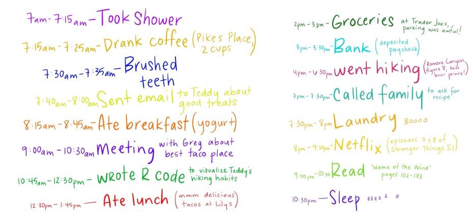
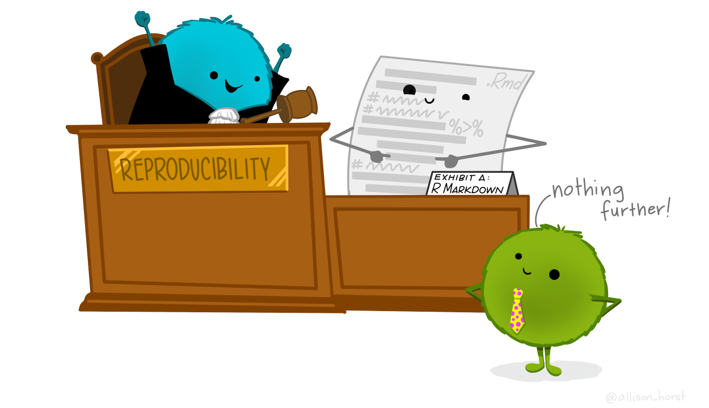
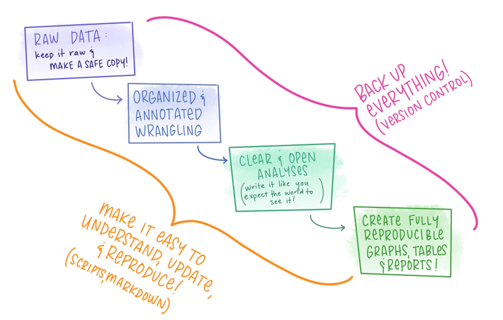
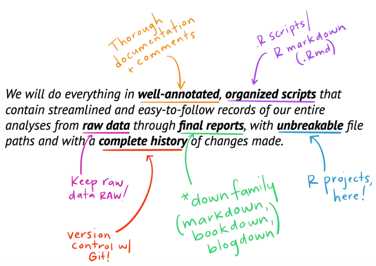

```{r setup, include=FALSE}
options(htmltools.dir.version = FALSE)
```

---
# Outline of class

1. Clone class repos

1. Proper file structure

1. Proper script structure

1. Reminder on R packages

1. Import Data
  
Lab 
1. Create file structure for class 

1. Basic markdown for Readme files


---

# Git Organizations

- Last class you learned how to create your own repo as an individual. Another cool think about GitHub is you can be part of an **organization** where you can keep lots of repos from one group together.

- You have all been added to GitHub Organization **Biol551_CSUN**. 
- You should have received an email asking you to accept (please do if you haven't already)


---
# Git Organizations
- Everything for our class will be in this organization.
- You will clone **two** repositories from our class organization today.

--

1. Spring-2021
  - This is where all the information for the class will be.
  - You **DO NOT** have access to push to this repo so that you do not accidentally change the lecture slides. You can only **pull**
  - Every day before class use *git pull* to download all the class materials

--

2. Your Last Name
  - This is where you will turn in all your assignments.  You, and currently only you, have access to **push** changes to your own repo.

--

Who wants to show us how to clone both of these repos onto their local computer?


---
# Working in git for this class

1.  Before class starts, navigate to "Spring-2021" in your projects (upper right-hand corner of RStudio) and **pull.**

--
1.   Next navigate to your personal repository and **pull**.  

### This is the repo you will work in during class.


---
 # Proper file structure
 
 This is a photo of one of my past working directories
 
 
 
 There is **NO** organization here.... It is impossible to find anything...
 
 
---
 # Don't be past me...
 In general, your repos should be set-up to have At least 3 subfolders: **Data**, **Scripts**, and **Output**.  
 
 Think of one repo as one project or publication or chapter.  Do not put everything you do in one single repo.
 
.center[ 
 
]

---
# File structure for this class...

Here, we will have one more level of structure to keep everything tidy and easy to find.

1. Have one folder for every week

1. Within that weekly folder have a folder named *Data*, *Scripts*, and *Output*. 

It will look like this...

--

- Week_3
  - Data
  - Scripts
  - Output
  
- Week_4
  - Data
  - Scripts
  - Output

- so on....
---

# Adding folders to Git

You can add all the contents in a folder at once by adding the folder

- *git add Week_3/*  will add all the contents in the *Week_3* folder so that you do not have to do it one by one

- Note, git will **not** put an empty folder on GitHub (because there is nothing inside). So, do not worry if you go to add your folder now and don't see anything on GitHub. There is nothing for git to save. 

---
# Reproducible Projects require clear readme files.

Some examples:

- [Jennifer Fields](https://github.com/jenniferfields/EcoFunORTidepools)

- [Danielle Becker](https://github.com/daniellembecker/Nutrient_sediment_loading_affect_coral_functionality)


 
---
# Readme files

1. Give an overview of what the reader will find

2. List the contents of the repository

3. If this is for a **publication**, list authors, journal information, funding (if relevant), citation, and content.


 
---
# How to edit a readme file

### Intro to Markdown - "Markdown is a lightweight markup language with plain text formatting syntax."

--

Why write with Markdown when you can press buttons in an interface to format your text? 

1. Markdown can be used for everything. People use it to create websites, documents, notes, books, presentations, email messages, and technical documentation.

--

2. Markdown is portable. Files containing Markdown-formatted text can be opened using virtually any application. If you decide you don’t like the Markdown application you’re currently using, you can import your Markdown files into another Markdown application. That’s in stark contrast to word processing applications like Microsoft Word that lock your content into a proprietary file format.

--

3. Markdown is platform independent. You can create Markdown-formatted text on any device running any operating system.

---
### Intro to Markdown - "Markdown is a lightweight markup language with plain text formatting syntax."


4) Markdown is future proof. Even if the application you’re using stops working at some point in the future, you’ll still be able to read your Markdown-formatted text using a text editing application. 

--

5) Markdown is everywhere. Websites like Reddit and GitHub support Markdown, and lots of desktop and web-based applications support it.

--

## How to learn

- Markdown guides [Markdown Basics](https://www.markdownguide.org/basic-syntax/)
- Free online tutorials [Online tutorial](https://www.markdowntutorial.com/)
- Free online Markdown editor [dillinger](https://dillinger.io/)


---
# Creating a transparent script

- Does your collaborators know what you did?
- Do you know what you did? Can you go back to the code in a year after a reviewer asked you to change your analysis?

New coders tend to start their code right away with no comments or explanations of what they are doing. But, again, we want to produce transparent and reproducible research. There have been times where I set-up a script poorly and had to go back to it after a year to re-analyze some data (reviewers are always asking to change analyses, aren’t they… ;) ). I, the creator of the code, could not figure out for the life of me what I did. It was a painful few days trying to remember why I was doing what I was doing; it definitely could have been avoided by using proper coding etiquette.


---

## My attorney is like “bummer...” 

.center[

]  


---

## I wrack my brain and come up with this order of things:

.center[
{width=30%}
]

.foot-note[Still not great...]


---


## But then! I remember I had a datebook with all this information...


 .center[]


---
# Do your **Data Sci** like it is going to need an **alibi**.




---
# With data that looks something like...

 

---

# The workflow we will grow in this class...

*We will do everything in **well-annotated, organized scripts** that contain streamlined and easy-to-follow records of our entire analyses from **raw data** through **final reports**, with **unbreakable file paths** and with **a complete history** of changes made.*   


---




---


# But first, why open science is best science
.center[

]


---
# Open Science

.center[
### *"Open science is not just about improving the way we share data and methods; it is also about improving the way we think, work and interact with each other. It’s about technology enabling social infrastructure that can promote inclusivity to create kinder science."*]

.foot-note[[Open Software Means Kinder Science. By Julia Stewart Lowndes on December 10, 2019](https://blogs.scientificamerican.com/observations/open-software-means-kinder-science/)]

---

# Open Science

## One scientist can only do so much  
- More data = more Power

--

## Science must be reproducible  

--

## Who paid for this data collection? 
- If on federal or state grant then the tax payers paid for your data  

--

## "Better and kinder science, done in less time and done together." - Julie Lowndes

---

# Examples of #OpenScience

{width=50%}

---

# Examples of #OpenScience

{width=50%}

---
# Why some people are scared....

.pull-left[
]

.pull-right[
]

.center[Work together, advance science, and don't waste time and money]

---

# Our tools this semester for open and reproducible science


---

# Git and Github solve this problem

## Git 
- Git is a distributed version control system. 
- Imagine if Dropbox (saving info on the cloud) and "Track changes" from MS word had a baby.  Git would be that baby.
- But, it's even better because Git is optimized for the things that data scientists spend a lot of time working on (e.g., code)
- There is a learning curve, but I promise you it is worth it.
 
--

## Github
 - Git and GitHub are two different things.
 - GitHub is an online hosting platform that provides an array of services that are built on the Git system. (There are also other platforms like Bitbucket and GitLab)
 - Just like we don't *need* RStudio to run R code, we don't *need* GitHub to use Git... but it will make our lives a lot easier


.foot-note[https://raw.githack.com/uo-ec607/lectures/master/02-git/02-Git.html]

---
# From software development...
Git and GitHub play a big role in global software development.
- There is a high probability that your fave app., program or package is built using Git-based tools (Rstudio is).

--

# ... to scientific research
- Git and GitHub help operationalise the ideals of open science and reproducibility
- Journals have increasingly strict requirements regarding reproducibility and data access. GH makes this easy (DOI integration, off-the-shelf licenses, etc )  
- I host all my code, data for my research papers, and research protocols on GH. 
- GH helps us to collaborate with others and, most importantly, **your future self.**


---
# Git and Rstudio work well together
 
 We will start with Rprojects to keep organized.

.center[ 
 
]

---
# 10 min break and then we will make our first repository together

---
# First, sign into GitHub and we will create a new repository

- Press the new button  


---
# We are going to make a test repo

- Fill in the name and description
- Click "add ReadMe"


---
# Here is your empty repo


---
# "Clone it" and bring it into Rstudio
- Click the green "code" button
- Click the clipboard to copy the link


---
# Open RStudio
- click the carrot on the top right 


- Click New project


---
# Create a version controlled project
- Click Version control


---
# Create a version controlled project
- Click Git


---
# Create a version controlled project
- Paste the url that you copied from GitHub
- Decide where you want it to live on your computer
- Click Create Project


---
# You have a version-controlled project!


.center[]

---
# So, now what....

### Most important things to know to version-control your repository
 # P
 # A
 # C
 # P


---

# So, now what....

### Most important things to know to version-control your repository
 # Pull      
 # Add           
 # Commit    
 # Push     

---

# So, now what....

### Most important things to know to version-control your repository
 # Pull      (please)
 # Add       (always)    
 # Commit    (carry)
 # Push      (pizza)
 
---
 
 # Most important commands

**Pull** - [git pull] this “downloads” any changes to your repository on github, by your collaborators, or your past self on a different machine. (always do this first! You may have forgotten that you made a change.)
 
--
 
**Add**  - [git add] this stages files. It tells git, "I want to add these to the repository"  
 
--
 
**Commit** - [git commit] this “saves” your changes with git (as opposed to ctrl+S which saves them to your local machine – although you should still do that too)
 
--
 
  - git commit always requires a message so that you know what changes you made. 
  - ex: git commit -a -m "I created a test repo"
  - "-a" means commit all (every change) "-m" means (I am adding a message). What you have in quotes is your message.
  
--
  
**Push**  - [git push] this “uploads” your changes to github.
 
---
# Work with git in the terminal

- First, let's create and save a simple script (save it as "testscript.R")

--

- Now, let's save it to git

--


- click on the terminal tab (next to console). This allows you to interact directly with your terminal

--

- type "git pull"  (it should say already up to date because you have not done anything yet)

--

- type git add testscript.R  (this stages the new script)

--

- type git commit -a -m "I am adding testscript"

--

- type git push 
  - you may get prompted for your username and password 

---
# What it should look like

Check github and see if it is there!  


---
# Let's do the same thing by clicking buttons

- make a new script (testscript2.R)

Find the git tab on the right-hand site


---
# Let's do the same thing by clicking buttons

- check the box next to testscript2.R (this adds it -- once you add a script, you never have to add it again. Only commit new changes)  


--

- click commit and add a message

---
# click commit and add a message


- press commit and when it is done hit close and exit out
- next hit "push"
- when it is done close it. You should no longer see "testscript2.R" in the upper right-hand side.
- check github! (Don't forget to refresh the webpage)

---
# Make some changes!
- Let's make some changes to testscript.R
- add any code you want to it, commit it (with a message), and push it
- click history (the clock on the top) to see what changes were made and by who
---
# Oh no!


- You notice that your cat walked across the screen totally screwed up your code.  Oh no!  

.center[

]

- It's ok... you can revert it
- Click the blue wheel and then revert
- Note: commit often (it will only revert back to the last commit you made. This is like pressing the save button. Do it with every major change to your script.)

---
# Delete this test repository

- click settings and scroll all the way to the bottom ('Danger Zone') and delete repository and follow directions


---

# Next class

- We will learn about proper file structure and how to set-up a transparent script.
- Send me your git username in slack **right now**. 

---

class: center, middle

# Thanks!

Slides created via the R package [**xaringan**](https://github.com/yihui/xaringan).

Some slides modified from Allison Horst, Jarret Byrnes


