```{r setup, include=FALSE}
options(htmltools.dir.version = FALSE)
```
<div style = "position:fixed; visibility: hidden">
$$\require{color}\definecolor{yellow}{rgb}{1, 0.8, 0.16078431372549}$$
$$\require{color}\definecolor{orange}{rgb}{0.96078431372549, 0.525490196078431, 0.203921568627451}$$
$$\require{color}\definecolor{green}{rgb}{0, 0.474509803921569, 0.396078431372549}$$
</div>

<script type="text/x-mathjax-config">
MathJax.Hub.Config({
  TeX: {
    Macros: {
      yellow: ["{\\color{yellow}{#1}}", 1],
      orange: ["{\\color{orange}{#1}}", 1],
      green: ["{\\color{green}{#1}}", 1]
    },
    loader: {load: ['[tex]/color']},
    tex: {packages: {'[+]': ['color']}}
  }
});
</script>

<style>
.yellow {color: #FFCC29;}
.orange {color: #F58634;}
.green {color: #007965;}
</style>


```{r flair_color, echo=FALSE}
library(flair)
yellow <- "#FFCC29"
orange <- "#F58634"
green <- "#007965"
```

---
# Outline of class

1. Responsible plotting

1. Intro to ggplot2


  
Lab 
1. Make your first plot


---
# Review

What are the 5 sections you should always have in your scripts?

---

# Why you should always look at your data

We have to really understand our data to be able to decide on the appropriate analyses to answer our research questions. It can also lead to unexpected & interesting research questions. That requires first **looking** at your data, usually in a number of ways, to ask questions like: 

--

- Are there interesting patterns, groups, trends or relationships?  
- How are observations distributed?  
- Are there outliers?  
- Is there notable bias in observations or missing observations?  

--

**When do I need to look at my data and think about it really hard before analyzing it?**  

--

***EVERY TIME***

--

**When can I just make assumptions about the data and some some regression or hypothesis testing or anything else without exploring it?**

--

***NEVER***

---
# Start exploring with visualizations that don't hide or assume anything about the data

.center[

]

---
# For continuous (measured) observations you might start with:

- Jitter plots (if logical groups exist)  
- Beeswarm plots (ggbeeswarm)  
- Scatterplots (2 variables, or map additional)  
- More variables: map w/ colors, size?


---
# Jitter plots:   
Show values of observations within a group, adding some amount of “jitter” so that they don’t all overlap 

.pull-left[
```{r, plot-label, eval=FALSE, warning=FALSE, message=FALSE}
library(tidyverse)
ggplot(chickwts, aes(x = feed, y = weight))+
  geom_jitter(aes(color = feed),
              alpha = 0.4,
              width = 0.1,
              height = 0,
              size = 3,
              show.legend = FALSE)+
  scale_color_brewer(palette = "Dark2")+
  theme_light()
```
]

.pull-right[
```{r plot-label-out, ref.label="plot-label", echo=FALSE}
```
]

---
# Sawrm plots:   
Show values of observations within a group, with amount of jitter dependent on density around values

.pull-left[
```{r, plot-label2, eval=FALSE, warning=FALSE, message=FALSE}
library(ggbeeswarm)
ggplot(iris, aes(x = Species, y = Petal.Length))+
  geom_jitter(aes(color = Species),
              alpha = 0.5,
              show.legend = FALSE)+
  scale_color_manual(values = c("purple",
                                "black",
                                "orange"))+
  theme_minimal()+
  labs(y = "Petal Length (cm)")
```
]

.pull-right[
```{r plot-label2-out, ref.label="plot-label2", echo=FALSE}
```
]

---
# Scatter plots:
Show relationship between two measured variables

.pull-left[
```{r, plot-label3, eval=FALSE, warning=FALSE, message=FALSE}
ggplot(faithful, aes(x = waiting, y = eruptions))+
  geom_point(aes(color = eruptions),
             show.legend = FALSE,
             size=2)+
  scale_color_gradient(low = "black",
                       high = "purple")+
  theme_bw()+
  labs(x = "Waiting time (min)",
       y = "Eruption duration (min)",
       title = "Old Faithful eruption patterns")
```
]

.pull-right[
```{r plot-label3-out, ref.label="plot-label3", echo=FALSE}
```
]
---
# Why can’t we just look at summary statistics?

.center[

]

---
# Why can’t we just look at summary statistics?


### Summary statistics hide important information!!

.foot-note[Originally created by Alberto Cairo in [Download the Datasaurus: Never trust summary statistics alone; always visualize your data](http://www.thefunctionalart.com/2016/08/download-datasaurus-never-trust-summary.html)
]

---
# Don't hide your data 

Weissgerber TL, Milic NM, Winham SJ, Garovic VD (2015) **Beyond Bar and Line Graphs: Time for a New Data Presentation Paradigm.** PLoS Biol 13(4): e1002128. https://doi.org/10.1371/journal.pbio.1002128  


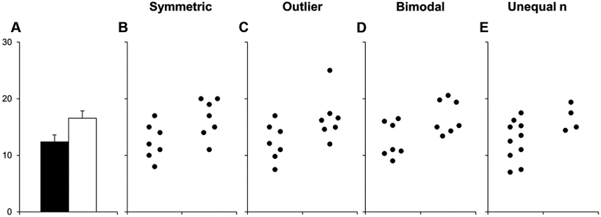

Would you draw the same conclusions with each of these datasets? 


---
# The hierarchy of data viz (according to Allison Horst)

1. Is it **correct**?

1. Is it **clear**?

1. Does it communicate data **responsibly**?

1. Does it look **awesome**?

---
# 1. Is it **correct**?

--

- Observations and experimental design

--

- Avoid data wrangling and calculation mistakes
  - Keep raw data raw
  - Check...check.. quadruple check data wrangling/cleaning
  - Look at your data frames at every step 
  - Compare your outcomes to expected results
  - Reproducibility and detailed annotation
  - Get an outside reviewer to check your code
  
--

- Units/labels

---

# 2. Is it **clear**?

-- 

- To many points, variables, or series

- Overwhelming legends

- Lack of useful emphasis

- Are things put in context?

- Is it a pie graph? (Don't do it)

- Overmapping aesthetics

- Is it 3D? (please no)

---
# Too many poinnts, variables or series

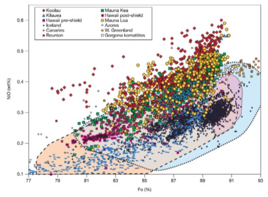

---
# Too many everything

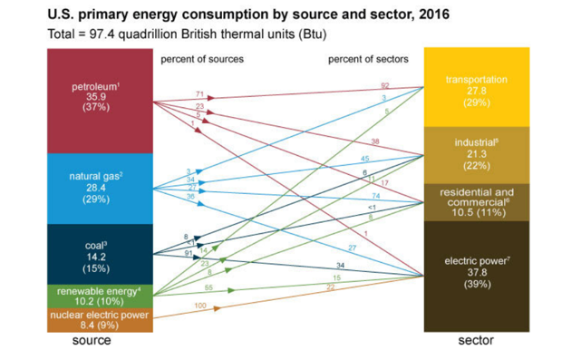
---
# **Emphasize** the things you want the audience or readers to remember

.center[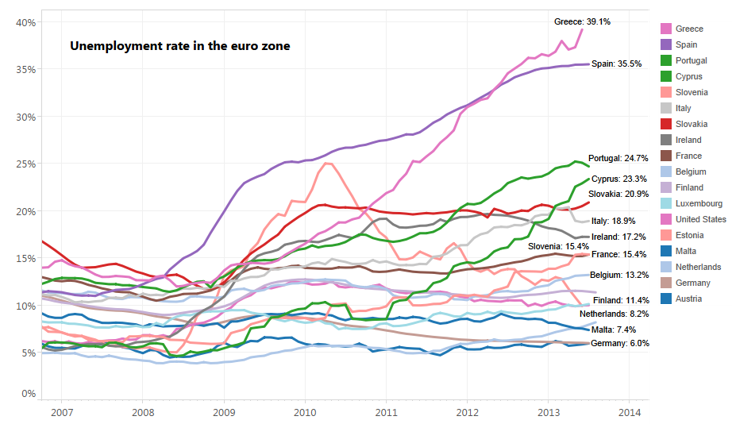]

---
# **Emphasize** the things you want the audience or readers to remember

.center[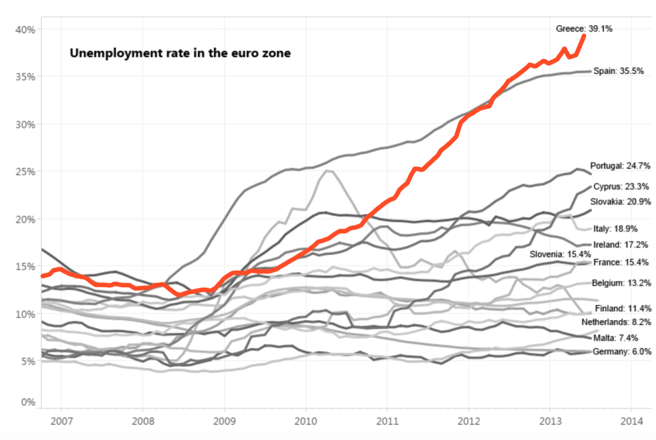]

---
# **Legends:**  
## Put them somewhere that reduces eyes jumping back and forth across the whole page

.center[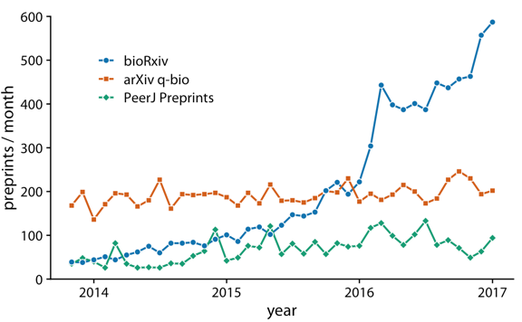]

.foot-note[[Fundamentals of Data Visualization by Claus O. Wilke 
](https://serialmentor.com/dataviz/)]
---

# Often for clarity, **labels are often easier than legends**
 

.center[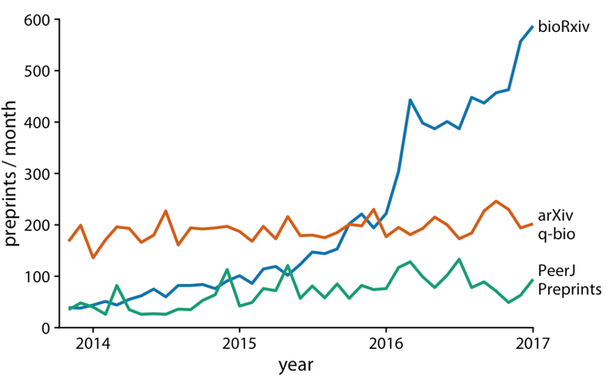]

.foot-note[[Fundamentals of Data Visualization by Claus O. Wilke 
](https://serialmentor.com/dataviz/)]
---

# Often for clarity, **labels are often easier than legends**
 

.center[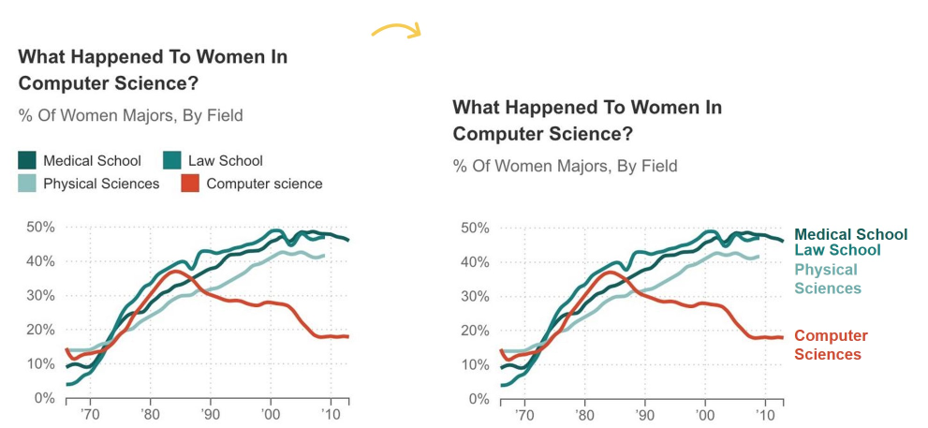]


.foot-note[[Depict Data Studio Directly Labeling Your Line Graphs](https://depictdatastudio.com/directly-labeling-line-graphs/)]
---
# Your legends should **definitely** follow a logical order

.center[
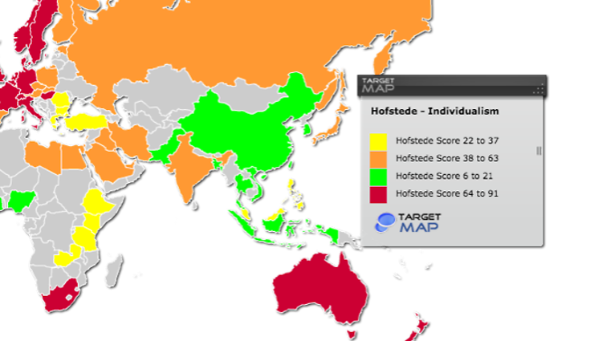]

---

## Consider putting things in **context** if visualizing across plots, for easier comparison

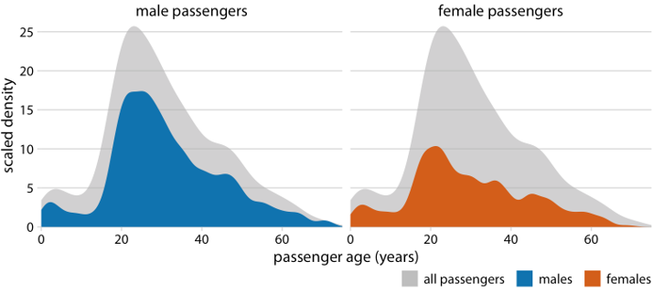

.foot-note[[Fundamentals of Data Visualization by Claus O. Wilke 
](https://serialmentor.com/dataviz/)]
---
# 3. Is it **responsible**?

- Is your graph type/model/presentation even appropriate? 

- Misleading axes ranges or direction  

- Masking data within summary statistics  

- Does it include a measure of uncertainty (if applicable)?  

---
# Misleading axes ranges or direction

- Reversing scale direction  
- Manipulating scale increments or data to make differences seem larger/less than they are  
- Cropping value scale to exaggerate differences   

---
# Reversing scale direction

.center[
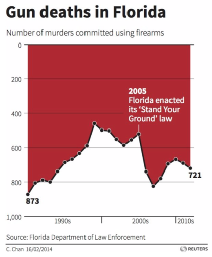]

.footnote[[https://viz.wtf/](https://viz.wtf/)]
---
# Manipulating scales

.center[
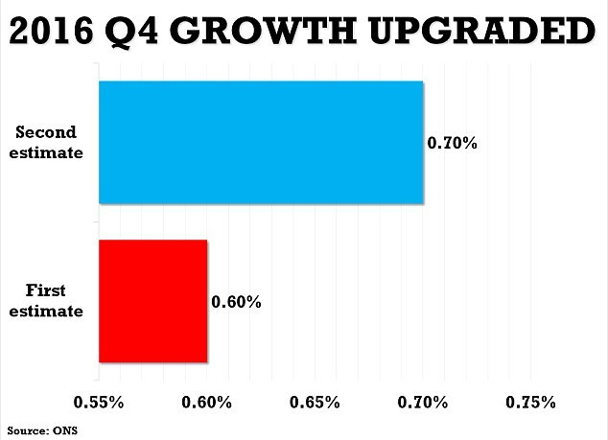]

.footnote[[https://viz.wtf/](https://viz.wtf/)]

---

# Manipulating scales

.center[

]

.footnote[[https://viz.wtf/](https://viz.wtf/)]

---
# Show me the data
Adding summary statistics, models, etc. is good - but try to also show me the *actual data*

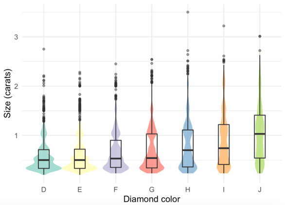

---
# Show me the data
Adding summary statistics, models, etc. is good - but try to also show me the *actual data*

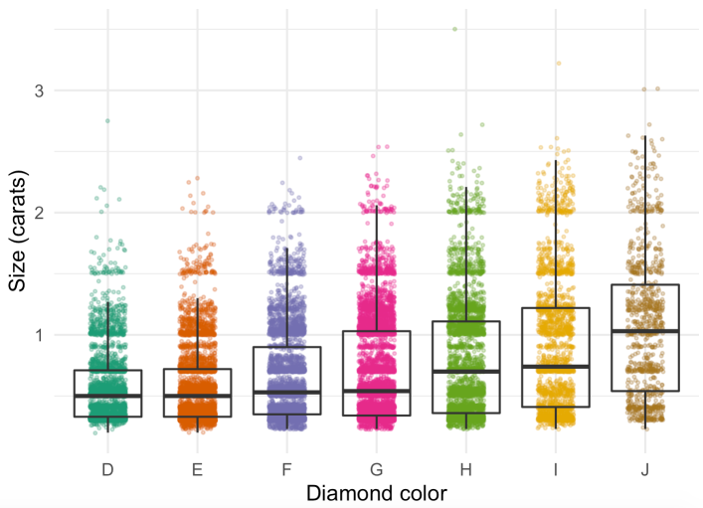

---
class: center, middle

# Thanks!

Slides created via the R package [**xaringan**](https://github.com/yihui/xaringan).

Some slides modified from Allison Horst, Data Science Box

[Allison Horst ESM 206](https://docs.google.com/presentation/d/1IlQlBbZo53C_NUl-A9MHxQZZiubiiyFKV_nf1hFwAeM/edit#slide=id.g9c1b4376f4_0_211)  
[Data Science Box](https://rstudio-education.github.io/datascience-box/course-materials/slides/u2-d02-ggplot2/u2-d02-ggplot2.html#1)


