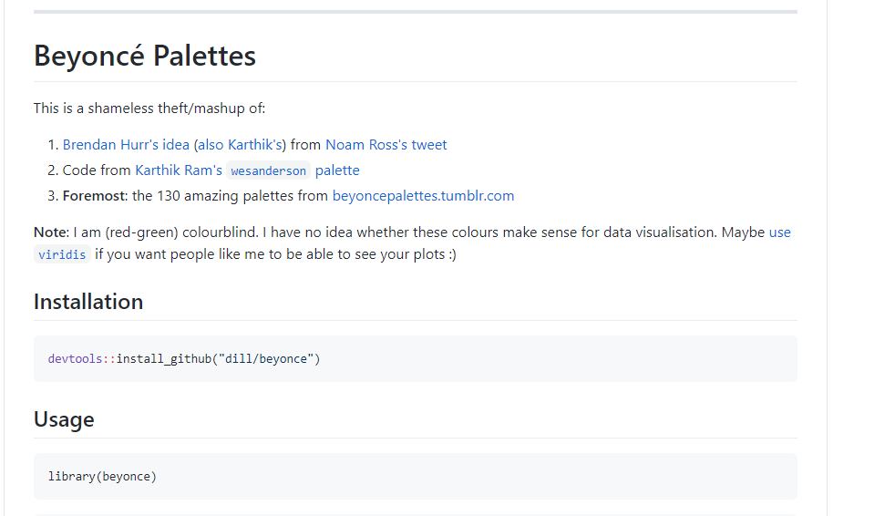

```{r setup, include=FALSE}
options(htmltools.dir.version = FALSE)
```
<div style = "position:fixed; visibility: hidden">
$$\require{color}\definecolor{yellow}{rgb}{1, 0.8, 0.16078431372549}$$
$$\require{color}\definecolor{orange}{rgb}{0.96078431372549, 0.525490196078431, 0.203921568627451}$$
$$\require{color}\definecolor{green}{rgb}{0, 0.474509803921569, 0.396078431372549}$$
</div>

<script type="text/x-mathjax-config">
MathJax.Hub.Config({
  TeX: {
    Macros: {
      yellow: ["{\\color{yellow}{#1}}", 1],
      orange: ["{\\color{orange}{#1}}", 1],
      green: ["{\\color{green}{#1}}", 1]
    },
    loader: {load: ['[tex]/color']},
    tex: {packages: {'[+]': ['color']}}
  }
});
</script>

<style>
.yellow {color: #FFCC29;}
.orange {color: #F58634;}
.green {color: #007965;}
</style>


```{r flair_color, echo=FALSE}
library(flair)
yellow <- "#FFCC29"
orange <- "#F58634"
green <- "#007965"
```

---
# Outline of class

1. Adding multiple geoms

1. Scales

1. Coordinates

1. Themes

1. Save your plots

1. ggplot extensions


  
Lab 
1. Make your own plot


---
# Review

What are some do's and don'ts for good visuals?

---
# Review: Grammar of graphics (ggplot2)
.green[ggplot2] is a data visualization package  

Structure of the plot can be summarized like this:

```{r, eval=FALSE}
ggplot(data = [dataset], 
       mapping = aes(x = [x-variable], 
                     y = [y-variable])) +
   geom_xxx() +
   other options
```

*aes()* means *aesthetics*  
*geom_xx* means *geometry*

--
  
    
    
### What is the difference between **mapping** and **setting**?

---
# Penguin data. Let's start our script

```{r, message=FALSE, warning=FALSE}
### Today we are going to plot penguin data ####
### Created by: Dr. Nyssa Silbiger #############
### Updated on: 2021-02-09 ####################


#### Load Libraries ######
library(palmerpenguins)
library(tidyverse)


### Load data ######
# The data is part of the package and is called penguins
# How else besides glimpse can we inspect the data?
glimpse(penguins) 


```

---
# Make a simple plot
.pull-left[
```{r, plot-labela, eval=FALSE, warning=FALSE, message=FALSE}
ggplot(data=penguins, 
  mapping = aes(x = bill_depth_mm,
                y = bill_length_mm)) +
  geom_point()+
   labs(x = "Bill depth (mm)", 
        y = "Bill length (mm)"
        ) 

```
]

.pull-right[
```{r plot-labela-out, ref.label="plot-labela", echo=FALSE, warning = FALSE}
```
]

---
# Add a best fit line
.pull-left[
```{r, plot-labelb, eval=FALSE, warning=FALSE, message=FALSE}
ggplot(data=penguins, 
  mapping = aes(x = bill_depth_mm,
                y = bill_length_mm)) +
  geom_point()+ 
  geom_smooth()+ #<<
   labs(x = "Bill depth (mm)", 
        y = "Bill length (mm)"
        ) 

# look up all the different methods
?geom_smooth() 
```
]

.pull-right[
```{r plot-labelb-out, ref.label="plot-labelb", echo=FALSE, warning = FALSE}
```
]

---
# Add a best fit line
### .orange[Make it a linear model]

.pull-left[
```{r, plot-labelc, eval=FALSE, warning=FALSE, message=FALSE}
ggplot(data=penguins, 
  mapping = aes(x = bill_depth_mm,
                y = bill_length_mm)) +
  geom_point()+ 
  geom_smooth(method = "lm")+ #<<
   labs(x = "Bill depth (mm)", 
        y = "Bill length (mm)"
        ) 

# Note you can put any formula here to make it specific to your analysis

```

There are 3 different species in this data, how do you think we should view the model?
]

.pull-right[
```{r plot-labelc-out, ref.label="plot-labelc", echo=FALSE, warning = FALSE}
```
]


---
# Add a best fit line
### Make it a linear model. .orange[Group by species.]

.pull-left[
```{r, plot-labeld, eval=FALSE, warning=FALSE, message=FALSE}
ggplot(data=penguins, 
  mapping = aes(x = bill_depth_mm,
                y = bill_length_mm,
                group = species)) + #<<
  geom_point()+ 
  geom_smooth(method = "lm")+ 
   labs(x = "Bill depth (mm)", 
        y = "Bill length (mm)"
        ) 

# Note you can put any formula here to make it specific to your analysis

```

]

.pull-right[
```{r plot-labeld-out, ref.label="plot-labeld", echo=FALSE, warning = FALSE}
```
]

---
# Add a best fit line
### Make it a linear model. Group by species. .orange[Add some colors by species.]

.pull-left[
```{r, plot-labele, eval=FALSE, warning=FALSE, message=FALSE}
ggplot(data=penguins, 
  mapping = aes(x = bill_depth_mm,
                y = bill_length_mm,
                group = species,
                color = species)) + #<<
  geom_point()+ 
  geom_smooth(method = "lm")+ 
   labs(x = "Bill depth (mm)", 
        y = "Bill length (mm)"
        ) +
  scale_color_viridis_d() #<<

# Note you can put any formula here to make it specific to your analysis

```

]

.pull-right[
```{r plot-labele-out, ref.label="plot-labele", echo=FALSE, warning = FALSE}
```
]

---
class: center, middle


---
# Aside....

### Celebrate your R victories with the *{praise}* package

```{r, eval=FALSE}
install.packages(praise)

```

```{r}
library(praise)
praise()
```

```{r}
praise()
```

```{r}
praise()
```
---
# Scales
# Back to penguins....

The naming scheme for *scale* has 3 parts:

1. scale  
1. The name of the primary aesthetic (e.g., color, shape, or x)
1. The name of the scale (e.g., continuous, discrete, manual).

--

If I want to change the scale of a continuous color it would be:
```{r, eval=FALSE}
scale_color_continuous()
```

--

If I want to change the scale of a continuous x-axis it would be:
```{r, eval=FALSE}
scale_x_continuous()
```

---
# Change scales
### .orange[Change x scale limits (0,20).]

.pull-left[
```{r, plot-labelf, eval=FALSE, warning=FALSE, message=FALSE}
ggplot(data=penguins, 
  mapping = aes(x = bill_depth_mm,
                y = bill_length_mm,
                group = species,
                color = species)) + 
  geom_point()+ 
  geom_smooth(method = "lm")+ 
   labs(x = "Bill depth (mm)", 
        y = "Bill length (mm)"
        ) +
  scale_color_viridis_d()+
  scale_x_continuous(limits = c(0,20)) # set x limits from 0 to 20 #<<

# Note anytime you make a vector you need to put "c" which means "concatenate

```

]

.pull-right[
```{r plot-labelg-out, ref.label="plot-labelg", echo=FALSE, warning = FALSE}
```
]

---
# Change scales
### Change x scale limits (0,20). .orange[Change y scale limits (0,50).]
Obviously, this is a terrible figure.... but this is how you change the limits

.pull-left[
```{r, plot-labelg, eval=FALSE, warning=FALSE, message=FALSE}
ggplot(data=penguins, 
  mapping = aes(x = bill_depth_mm,
                y = bill_length_mm,
                group = species,
                color = species)) + 
  geom_point()+ 
  geom_smooth(method = "lm")+ 
   labs(x = "Bill depth (mm)", 
        y = "Bill length (mm)"
        ) +
  scale_color_viridis_d()+
  scale_x_continuous(limits = c(0,20)) + # set x limits from 0 to 20 
  scale_y_continuous(limits = c(0,50))#<<

# Note anytime you make a vector you need to put "c" which means "concatenate

```

]

.pull-right[
```{r plot-labelg-out, ref.label="plot-labelg", echo=FALSE, warning = FALSE}
```
]

---
# Change scales
### .orange[Change x breaks.]

.pull-left[
```{r, plot-labelh, eval=FALSE, warning=FALSE, message=FALSE}
ggplot(data=penguins, 
  mapping = aes(x = bill_depth_mm,
                y = bill_length_mm,
                group = species,
                color = species)) + 
  geom_point()+ 
  geom_smooth(method = "lm")+ 
   labs(x = "Bill depth (mm)", 
        y = "Bill length (mm)"
        ) +
  scale_color_viridis_d()+
  scale_x_continuous(breaks = c(14, 17, 21)) #<<
 

# Note anytime you make a vector you need to put "c" which means "concatenate

```

]

.pull-right[
```{r plot-labelh-out, ref.label="plot-labelh", echo=FALSE, warning = FALSE}
```
]

---

# Change scales
### Change x breaks. .orange[Change x break labels]

.pull-left[
```{r, plot-labeli, eval=FALSE, warning=FALSE, message=FALSE}
ggplot(data=penguins, 
  mapping = aes(x = bill_depth_mm,
                y = bill_length_mm,
                group = species,
                color = species)) + 
  geom_point()+ 
  geom_smooth(method = "lm")+ 
   labs(x = "Bill depth (mm)", 
        y = "Bill length (mm)"
        ) +
  scale_color_viridis_d()+
  scale_x_continuous(breaks = c(14, 17, 21), 
                     labels = c("low", "medium", "high")) #<<
 

# Note anytime you make a vector you need to put "c" which means "concatenate

```

]

.pull-right[
```{r plot-labeli-out, ref.label="plot-labeli", echo=FALSE, warning = FALSE}
```
]

---
# Change scales
### .orange[Manually change color scale.]

.pull-left[
```{r, plot-labelj, eval=FALSE, warning=FALSE, message=FALSE}
ggplot(data=penguins, 
  mapping = aes(x = bill_depth_mm,
                y = bill_length_mm,
                group = species,
                color = species)) + 
  geom_point()+ 
  geom_smooth(method = "lm")+ 
   labs(x = "Bill depth (mm)", 
        y = "Bill length (mm)"
        ) +
  #scale_color_viridis_d() #<<
  scale_color_manual(values = c("orange", "purple", "green")) #<<
 

# Note anytime you make a vector you need to put "c" which means "concatenate

```

]

.pull-right[
```{r plot-labelj-out, ref.label="plot-labelj", echo=FALSE, warning = FALSE}
```
]

---
# Custom color scales

### There are .orange[**so many**] custom color palettes to play with.

[Most popular color palettes](https://www.datanovia.com/en/blog/top-r-color-palettes-to-know-for-great-data-visualization/) [Beyonce - tumblr!!!](https://beyoncepalettes.tumblr.com/)  
[Beyonce - color palette](https://github.com/dill/beyonce)  
[Colors of California](https://github.com/an-bui/calecopal)                     
[Colors of the Pacific Northwest](https://github.com/jakelawlor/PNWColors)    

---

### Aside on downloading packages that are *in development*.
There are several packages on GitHub that are not yet published and are still being developed.  You can still use them, but you need to install them directly from github.  

First, you need to install the *{devtools}* package (Development tools) 

```{r, eval=FALSE}
install.packages('devtools')
```

--

Instead of using *install.packages("PackageName")*, we use *install_github("username/packagename")*.

--

Let's download the beyonce color palette.

1. Ask google where the "Beyonce color palette in R" is. 
1. Go to the [github page](https://github.com/dill/beyonce) and follow the directions

.center[
]


---
### Aside on downloading packages that are *in development*.
There are several packages on GitHub that are not yet published and are still being developed.  You can still use them, but you need to install them directly from github.  

First, you need to install the *{devtools}* package (Development tools) 

```{r, eval=FALSE}
install.packages('devtools')
```


Instead of using *install.packages("PackageName")*, we use *install_github("username/packagename")*.


Let's download the beyonce color palette.

1. Ask google where the "Beyonce color palette in R" is. 
1. Go to the [github page](https://github.com/dill/beyonce) and follow the directions
1. In your **console** (not your script): copy and paste:

```{r, eval=FALSE}
devtools::install_github("dill/beyonce")
```

---
### Aside on downloading packages that are *in development*.
There are several packages on GitHub that are not yet published and are still being developed.  You can still use them, but you need to install them directly from github.  

First, you need to install the *{devtools}* package (Development tools) 

```{r, eval=FALSE}
install.packages('devtools')
```


Instead of using *install.packages("PackageName")*, we use *install_github("username/packagename")*.


Let's download the beyonce color palette.

1. Ask google where the "Beyonce color palette in R" is. 
1. Go to the [github page](https://github.com/dill/beyonce) and follow the directions
1. In your **console** (not your script): copy and paste:
1. In the **libraries section of your script**: copy and paste

```{r}
library(beyonce)
```

---
# Change scales
### .orange[Use one of the Beyonce color palettes.]

.pull-left[
```{r, plot-labelk, eval=FALSE, warning=FALSE, message=FALSE}
ggplot(data=penguins, 
  mapping = aes(x = bill_depth_mm,
                y = bill_length_mm,
                group = species,
                color = species)) + 
  geom_point()+ 
  geom_smooth(method = "lm")+ 
   labs(x = "Bill depth (mm)", 
        y = "Bill length (mm)"
        ) +
  scale_color_manual(values = beyonce_palette(2)) #<<


```

]

.pull-right[
```{r plot-labelk-out, ref.label="plot-labelk", echo=FALSE, warning = FALSE}
```
]


---
# Change scales
### .orange[Use one of the Beyonce color palettes.]

.pull-left[
```{r, plot-labell, eval=FALSE, warning=FALSE, message=FALSE}
ggplot(data=penguins, 
  mapping = aes(x = bill_depth_mm,
                y = bill_length_mm,
                group = species,
                color = species)) + 
  geom_point()+ 
  geom_smooth(method = "lm")+ 
   labs(x = "Bill depth (mm)", 
        y = "Bill length (mm)"
        ) +
  scale_color_manual(values = beyonce_palette(10)) #<<


```

]

.pull-right[
```{r plot-labell-out, ref.label="plot-labell", echo=FALSE, warning = FALSE}
```
]


---
# ggplot2 resources

[Data to viz](https://www.data-to-viz.com/#histogram)  
[ggplot2 cheatsheet](https://github.com/rstudio/cheatsheets/blob/master/data-visualization-2.1.pdf)  
[All the geoms](https://ggplot2.tidyverse.org/reference/)  
[A master list of visuals](http://r-statistics.co/Top50-Ggplot2-Visualizations-MasterList-R-Code.html)   
[Practical ggplot](https://wilkelab.org/practicalgg/)   
[R graph gallery](https://www.r-graph-gallery.com/)  

--
## More plotting fun and details on "Tidy Tuesday" next class.


---
class: center, middle

# Thanks!

Slides created via the R package [**xaringan**](https://github.com/yihui/xaringan).

Some slides modified from Allison Horst, Data Science Box

[Allison Horst ESM 206](https://docs.google.com/presentation/d/1IlQlBbZo53C_NUl-A9MHxQZZiubiiyFKV_nf1hFwAeM/edit#slide=id.g9c1b4376f4_0_211)  
[Data Science Box](https://rstudio-education.github.io/datascience-box/course-materials/slides/u2-d02-ggplot2/u2-d02-ggplot2.html#1)


