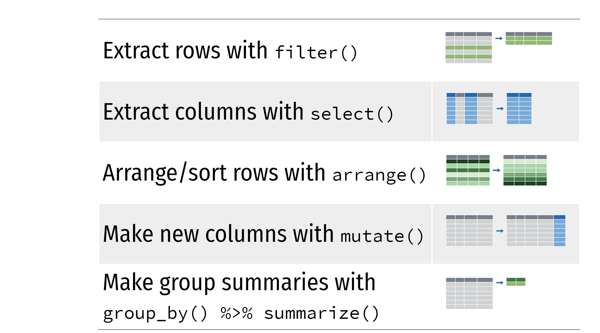
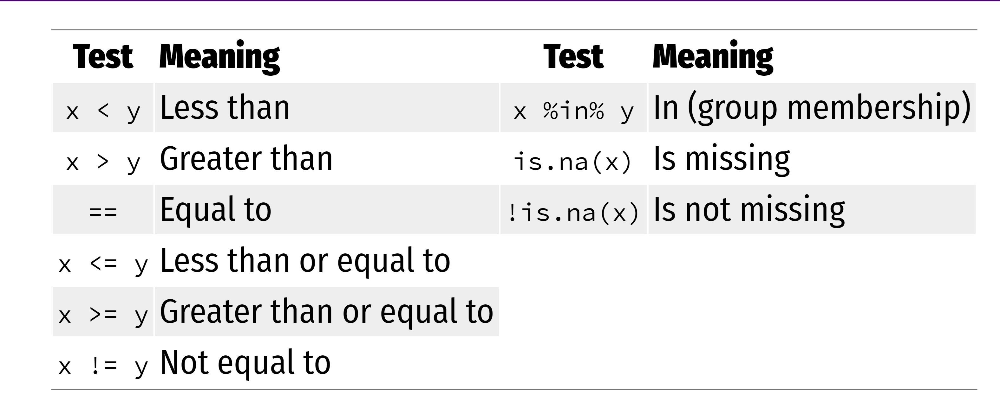
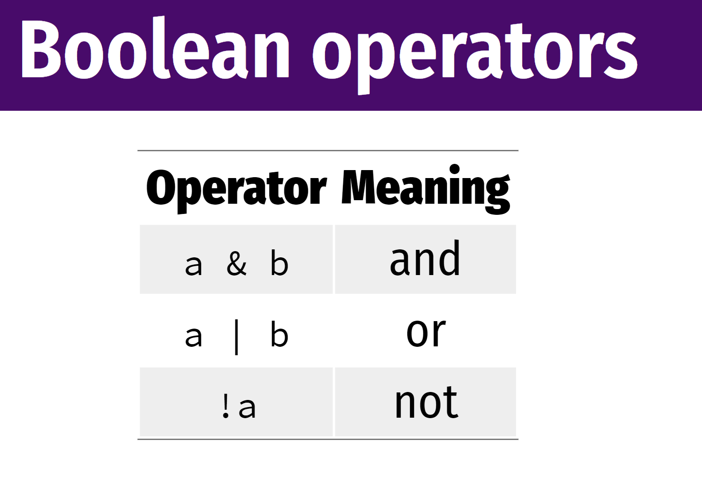
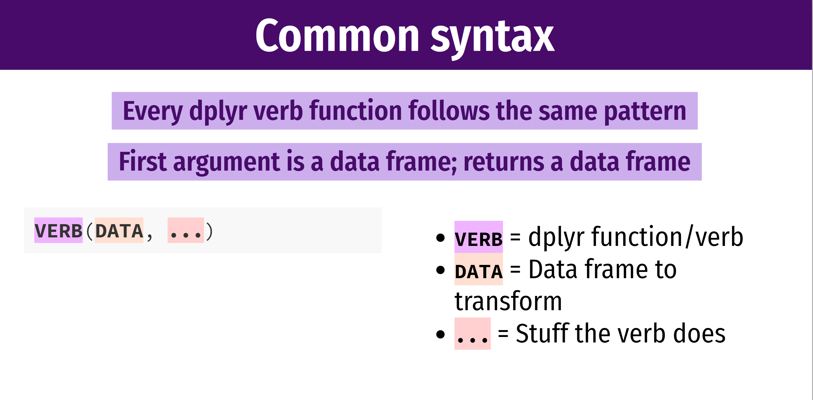

```{r setup, include=FALSE}
options(htmltools.dir.version = FALSE)
```
<div style = "position:fixed; visibility: hidden">
$$\require{color}\definecolor{yellow}{rgb}{1, 0.8, 0.16078431372549}$$
$$\require{color}\definecolor{orange}{rgb}{0.96078431372549, 0.525490196078431, 0.203921568627451}$$
$$\require{color}\definecolor{green}{rgb}{0, 0.474509803921569, 0.396078431372549}$$
</div>

<script type="text/x-mathjax-config">
MathJax.Hub.Config({
  TeX: {
    Macros: {
      yellow: ["{\\color{yellow}{#1}}", 1],
      orange: ["{\\color{orange}{#1}}", 1],
      green: ["{\\color{green}{#1}}", 1]
    },
    loader: {load: ['[tex]/color']},
    tex: {packages: {'[+]': ['color']}}
  }
});
</script>

<style>
.yellow {color: #FFCC29;}
.orange {color: #F58634;}
.green {color: #007965;}
</style>


```{r flair_color, echo=FALSE}
library(flair)
yellow <- "#FFCC29"
orange <- "#F58634"
green <- "#007965"
```

---
# Outline of class

1. Intro to {dplyr}
 - a set of verbs for manipulating data:
  - filtering rows, selecting columns, grouping by objects, getting summary statistics, mutating columns, removing NAs

Lab 
1. Practice with dplyr


---
# Review

1. Where do I change the font size of my x and y labels?

1. How do I save my plot?
---
# Intro to the {dplyr} package (part of the TidyVerse)

.center[

]


---
# dplyr: verbs for manipulating data

---
# Penguin data again.

```{r, message=FALSE, warning=FALSE}
### Today we are going to plot penguin data ####
### Created by: Dr. Nyssa Silbiger #############
### Updated on: 2021-02-15 ####################


#### Load Libraries ######
library(palmerpenguins)
library(tidyverse)
library(here)


### Load data ######
# The data is part of the package and is called penguins
glimpse(penguins) 


```

---
# Filter


---
#Filter 
### Extract rows that meet some critera

.pull-left[
```{r, eval = FALSE}
filter(.data = DATA, ...)
```
]

.pull-right[
- .orange[DATA] = Data frame to transform  

- .orange[...] = One or more criteria  
filter() returns each row for which the criteria is TRUE
]

---
# filter only the female penguins
### As always, exact spelling and capitalization matters

Before filtering
```{r}
head(penguins)
```

---
# filter only the female penguins
### As always, exact spelling and capitalization matters

After filtering
```{r}
filter(.data = penguins, sex == "female" )
```

---
# filter

.pull-left[

```{r, eval=FALSE}
filter(.data = penguins, 
       sex == "female" ) #<<
```
]

.pull-right[
One .green[=] sets an argument in the function  

Two .green[==] reads as "is exactly equal to." It is a question that returns a TRUE or FALSE.  Here, filter keeps every TRUE
]

---
# A list of logical expressions 




---
# How would I use filter to...

1. Penguins measured in the year 2008?

1. Penguins that have a body mass greater than 5000

--

# Think, pair, share.  

Spend 60 seconds to *think* about it. Spend 60 seconds *paired* in a breakout room to discuss your answers. *Share* with the class.

---
# Common mistakes

.pull-left[
## Using .orange[=] instead of .orange[==]

```{r example-model, include=FALSE, eval=FALSE, results="hide"}
#filter(.data = penguins,
  #sex = "females")

filter(.data = penguins, 
       sex == "females")
```

```{r colored-model, echo=FALSE}
decorate("example-model") %>% 
  flair("=", background = "#FF851B") %>% 
  flair("==", background = "#0074D9") %>% 
  knit_print.with_flair()
```
]  

--
.pull-right[

## Forgetting quotes  

```{r, eval=FALSE}
filter(.data == penguins, 
        sex = females) #<<

filter(.data = penguins, 
       sex == "females")
```


]

---

# Filter with multiple conditions

Select .orange[females] that are also .green[greater than 4000 g]

```{r}
filter(.data = penguins, sex == "female", body_mass_g >4000)

```

---


---
# Default for filter is **&**

These do the same exact thing

```{r, eval=FALSE}
filter(.data = penguins, sex == "female", body_mass_g >4000)

filter(.data = penguins, sex == "female" & body_mass_g >4000)

```

---

# Think, pair, share

Use filter and boolean logical to show:

1. Penguins that were collected in *either* 2008 *or* 2009

1. Penguins that *are not* from the island Dream

1. Penguins in the species Adelie and Gentoo

---
# Common mistakes

.pull-left[
### Collapsing multiple tests into one 
penguins between 3000 and 5000 g
```{r, eval  = FALSE}
#Wrong
filter(.data = penguins,
       3000 < body_mass_g <5000) #<<

#Right
filter(.data = penguins, 
       body_mass_g <5000, #<<
       body_mass_g >3000 #<<

```
]

--

.pull-right[
### Using multiple tests instead of %in%
penguins in dream and biscoe

```{r, eval=FALSE}
# Wrong
filter(.data = penguins,
       island == "Dream", #<<
       island == "Biscoe") #<<

# Right
filter(.data = penguins,
       island %in% c("Dream","Biscoe")) #<<

```

]

---

---
class: center, middle

# Thanks!

Slides created via the R package [**xaringan**](https://github.com/yihui/xaringan).

Some slides modified from [Andrew Wheiss ](https://evalsp21.classes.andrewheiss.com/projects/01_lab/slides/01_lab.html#73)


